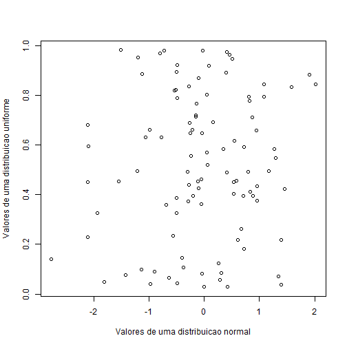
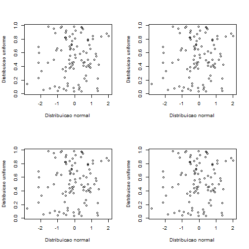
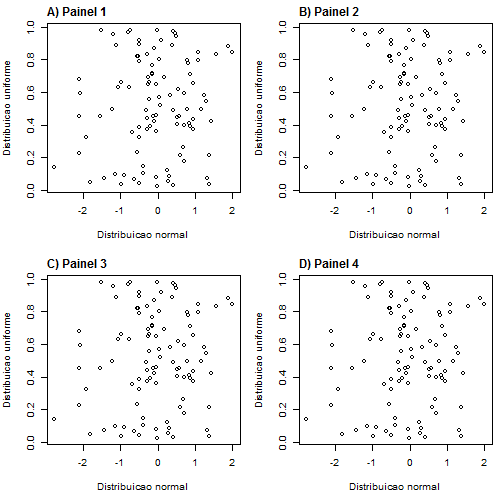

# Criando figuras de alta qualidade

## Introdução
O R é um programa que pode gerar gráficos muitos legais, com altíssimos graus de refinamentos e ajustes possíveis. Por isso, o cógido para um único gráfico pode conter diversas linhas de comando e levar um bom tempo pra ser finalizado.

Porém, é comum um sentimento de frustração quando salvamos os gráficos diretamente do R ou RStudio via menus embutidos. Nesse post mostrarei dicas de como resolver alguns desses problemas. Vamos ver como salvar diretamente os gráficos do R em PDF usando linhas de comando para ter maior controle do processo e não perder nada de qualidade. Isso também garantirá que um gráfico gerado no R ou no RStudio, ou em computadores com telas de tamanhos diferentes não afetem o resultado gráfico.

**Vantagens:** controle sobre a produção gráfica e geração de gráficos com altíssima qualidade.  
**Desvantagens:** Mais algumas linhas de comando e argumentos para configurar.


## Um gráfico de testes
Se estiver a postos no seu escritório ou mesmo no sofá com seu computador à frente e Netflix na visão periférica, você já está aptop a começar. No primeiro passo, vamos gerar alguns dados aleatórios e testar a saída gráfica.


```r
x <- rnorm(100)  # 100 valores de uma distribuição normal
y <- runif(100)  # 100 valores de uma distribuição uniforme

plot(y ~ x, xlab="Valores de uma distribuicao normal", 
  ylab="Valores de uma distribuicao uniforme")
```



Se você estiver utilizando o Windows, com o gráfico gerado acima aberto e a janela gráfica ativa, consulte o menu *Arquivo > Salvar como...* no R (confira as opções do RStudio no menu de gráficos).

As opções disponíveis parecem promissoras: Metafile, Postscript, PDF, PNG, BMP, TIFF e JPEG (+ SVG no RStudio). Eu descartaria diretamente BMP. Postscript e Metafile são opções interessantes para impressão, mas mais difíceis de utilizar. Por exemplo, arquivos desses dois tipos normalmente não podem ser abertos diretamente simplesmente para dar um conferida no resultado, limitando seu uso.

Restam PDF, PNG, TIFF e JPEG. Recomendo que você faça um teste e salve o gráfico em cada um desses formatos. Confira um por um os arquivos resultantes e decida qual parece ter a qualidade esperada. Dê zoom nas figuras durante a visualização dos arquivos para auxiliar na escolha. Eu ficaria com o PDF em função desse teste.

Então, por hoje é só? Basta saber que devemos salvar nossos gráficos em PDF para evitar perda de qualidade? Não é tão simples... Precisamos saber de mais algums detalhes para não jogar fora o esforço gasto com todas aquelas linhas de comando. Para isso, vamos aprender *mais algumas* linhas de comando. Não se assuste, são duas na verdade (e mais algumas conferidas antes de prosseguir).


## Conferindo o diretório de trabalho
Para salvar figuras de qualidade em PDF, precisamos usar linhas de comando e saber em que diretório estamos trabalhando. para saber em que diretório de trabalho estamos trabalhando, podemos usar o comando `getwd()`.

Se a pasta apresentada faz sentido e é onde você quer salvar seus gráficos, pode pular para a próxima etapa. Se quiser modificar o local de salvamento, continue com o comando `setwd(choose.dir())` para escolher uma pasta. Feito isso, use novamente o comando `getwd()` para verificar se tudo está de acordo.


## Salvando gráficos com linhas de comando
Os passos anteriores servem para facilitar o salvamento dos gráficos com linhas de comando, pois agora podemos salvar novos gráficos apenas com um nome de arquivo, sem especificar a pasta. 

Como isso é feito? São necessários pelo menos três comandos: um para definir o nome de arquivo e configurações adicionais de salvamento, outro para gerar o gráfico (pode trocar por aquela lista de comandos que vocês levou uma semana para acertar), e um comando para fechar o arquivo. Vamos a um exemplo com o gráfico gerado anteriormente.

```
# 1
pdf("grafico entre x e y.pdf")
# 2
plot(y ~ x, xlab="Valores de uma distribuicao normal", 
  ylab="Valores de uma distribuicao uniforme")
# 3
dev.off()
```

O ideal é receber apenas uma mensagem como `null device  1`. Isso quer dizer que o arquivo foi salvo no arquivo sem problemas. Se foi esse o caso, vá até a pasta e confira o PDF gerado (arquivo chamado "grafico entre x e y.pdf", como especificado no comando # 1). O arqvuio deve conter o gráfico desejado.

Causas comuns de erros nessa sequência de comandos são ter outras janelas de gráfico abertas (feche todas as janelas de gráfico ou, no RStudio, adicione um comando `dev.off()` antes do comando # 1, que irá fechar todos os gráficos antes de prosseguir) ou tentar salvar no mesmo arquivo com ele aberto no seu visualizador de PDF (comum quando se gera um gráfico, abre o arquivo para verificar, volta ao R para modificar e tenta salvar novamente com o AdobeReader ou Foxit com o arquivo aberto).


## Indo um pouco além
Podemos personalizar um pouco mais nossos gráficos para garantir o resultado desejado. Por exemplo, digamos que uma revista pede que os gráficos tenham até 11 cm de largura. Porque resolver isso depois se podemos salvar nesse tamanho?

Como? Basta configurar a largura no comando `pdf()`. Por exemplo, no código abaixo, iremos indicar a largura máxima de 11 cm via opção *width*. 

```
pdf("grafico entre x e y.pdf", width=4.33071)
plot(y ~ x, xlab="Valores de uma distribuicao normal", 
  ylab="Valores de uma distribuicao uniforme")
dev.off()
```

Veja que a função `pdf` aceita apenas valores de largura (*width*) ou altura (*height*) em polegadas. Para isso, foi necessário converter 11 cm para polegadas (4,33071) e informar esse valor no comando. Se você conferir o resultado, verá que a altura ficou maior que a largura, pois o padrão do R é altura e largura igual a 7 polegadas. Como não informamos a altura, o padrão de 7 polegadas foi utilizado. Como nosso gráfico deve ficar bem melhor quadrado, basta informar as duas medidas iguais.


```
pdf("grafico entre x e y.pdf", width=4.33071, height=4.33071)
plot(y ~ x, xlab="Valores de uma distribuicao normal", ylab="Valores de uma distribuicao uniforme")
dev.off()
```


## Facilitando (ou complicando) um pouco mais

Digamos que você precisa criar uma figura com quatro gráficos, em um layout de duas linhas e duas colunas. Isso pode ser feito com a função `par(mfrow=c(2, 2))`. Vamos ver como ficaria isso na tela com a seguinte sequência de comandos (para salvar direto em PDF, remova o símbolo "#" antes da primeira e da última linha de comando):


```r
# pdf("minha.figura.4.graficos.pdf")  # usar para salvar diretamente
par(mfrow=c(2, 2))
# Comandos para o gráfico 1
plot(y ~ x, xlab="Distribuicao normal", ylab="Distribuicao uniforme")
# Comandos para o gráfico 2
plot(y ~ x, xlab="Distribuicao normal", ylab="Distribuicao uniforme")
# Comandos para o gráfico 3
plot(y ~ x, xlab="Distribuicao normal", ylab="Distribuicao uniforme")
# Comandos para o gráfico 4
plot(y ~ x, xlab="Distribuicao normal", ylab="Distribuicao uniforme")
# dev.off()  # usar para salvar diretamente
```



Nada mal. Mas alguns pontos podem ser melhorados. Por exemplo, dimunuir o espaço entre gráficos para utilizar melhor o espaço (adicionando o argumento `mar=c(5, 4, 2, 1)` na função `par(...)`), que irá diminuir especialmente o espaço acima de cada gráfico (terceiro valor numérico). Outra melhoria, pode ser adicionar o comando `mtext()` após cada gráfico para configurar uma letra indicativa em cada gráfico, que pode ser associada na legenda da figura para explicar o que é cada gráfico. Vamos ao código:


```r
# pdf("minha.figura.4.graficos.pdf")  # usar para salvar diretamente
par(mfrow=c(2, 2), mar=c(5, 4, 2, 1))
# Comandos para o gráfico 1
plot(y ~ x, xlab="Distribuicao normal", ylab="Distribuicao uniforme")
mtext("A) Painel 1", side=3, line=0.5, adj=0, font=2)
# Comandos para o gráfico 2
plot(y ~ x, xlab="Distribuicao normal", ylab="Distribuicao uniforme")
mtext("B) Painel 2", side=3, line=0.5, adj=0, font=2)
# Comandos para o gráfico 3
plot(y ~ x, xlab="Distribuicao normal", ylab="Distribuicao uniforme")
mtext("C) Painel 3", side=3, line=0.5, adj=0, font=2)
# Comandos para o gráfico 4
plot(y ~ x, xlab="Distribuicao normal", ylab="Distribuicao uniforme")
mtext("D) Painel 4", side=3, line=0.5, adj=0, font=2)
# dev.off()  # usar para salvar diretamente
```



Teste a saída em PDF. Se algum texto ficar muito pequeno, você pode configurar tamanhos maiores aumentando o valor padrão do argumento `cex` da função `par()`. O valor padrão é 1. Valores maiores que 1 aumentam o tamanho de partes do seu texto. Valores menores que 1, diminuem. Teste a criação do PDF abaixo e veja o resultado.


```r
pdf("minha.figura.4.graficos.pdf", width=4.33071, height=4.33071)
par(mfrow=c(2, 2), mar=c(5, 4, 2, 1))
# Comandos para o gráfico 1
plot(y ~ x, xlab="Distribuicao normal", ylab="Distribuicao uniforme")
mtext("A) Gráfico 1", side=3, line=0.5, adj=0, font=2)
# Comandos para o gráfico 2
plot(y ~ x, xlab="Distribuicao normal", ylab="Distribuicao uniforme")
mtext("B) Gráfico 2", side=3, line=0.5, adj=0, font=2)
# Comandos para o gráfico 3
plot(y ~ x, xlab="Distribuicao normal", ylab="Distribuicao uniforme")
mtext("C) Gráfico 3", side=3, line=0.5, adj=0, font=2)
# Comandos para o gráfico 4
plot(y ~ x, xlab="Distribuicao normal", ylab="Distribuicao uniforme")
mtext("D) Gráfico 4", side=3, line=0.5, adj=0, font=2)
dev.off()
```

Os símbolos e fontes ficam meio grandes e você deve ter ficado com vontade de desistir ou editar o gráfico no Paintbrush. Mas não, não faça isso depois de tanto esforço. Basta algumas configurações na função `par()` para ajustar os tamanhos utilizando `cex=0.7` (símbolos e alguns textos), `cex.lab=0.8` (para o tamanho das legendas dos eixos), e `cex.axis=0.7` (para os números nos eixos). Por fim, adicione o argumento `cex=0.7` em cada uso da função `mtext()`. Segue a versão atualizada do código com as alterações no comando `par()`.


```r
pdf("minha.figura.4.graficos.pdf", width=4.33071, height=4.33071)
par(mfrow=c(2, 2), mar=c(5, 4, 2, 1), cex=0.7, cex.lab=0.8, cex.axis=0.6)
# Comandos para o gráfico 1
plot(y ~ x, xlab="Distribuicao normal", ylab="Distribuicao uniforme")
mtext("A) Gráfico 1", side=3, line=0.5, adj=0, font=2, cex=0.7)
# Comandos para o gráfico 2
plot(y ~ x, xlab="Distribuicao normal", ylab="Distribuicao uniforme")
mtext("B) Gráfico 2", side=3, line=0.5, adj=0, font=2, cex=0.7)
# Comandos para o gráfico 3
plot(y ~ x, xlab="Distribuicao normal", ylab="Distribuicao uniforme")
mtext("C) Gráfico 3", side=3, line=0.5, adj=0, font=2, cex=0.7)
# Comandos para o gráfico 4
plot(y ~ x, xlab="Distribuicao normal", ylab="Distribuicao uniforme")
mtext("D) Gráfico 4", side=3, line=0.5, adj=0, font=2, cex=0.7)
dev.off()
```

Por fim, se você for meio perfeccionista, pode achar que vale a pena diminuir o espaço em branco entre os valores dos eixos e as legendas dos eixos (eu faria isso). Novamente, temos que ajustar isso com um novo argumento na função `par`: `mgp=c(1.5, 0.5, 0)`. Segue o código atualizado:


```r
pdf("minha.figura.4.graficos.pdf", width=4.33071, height=4.33071)
par(mfrow=c(2, 2), mar=c(5, 4, 2, 1), cex=0.7, cex.lab=0.8, cex.axis=0.6, mgp=c(1.5, 0.5, 0))
# Comandos para o gráfico 1
plot(y ~ x, xlab="Distribuicao normal", ylab="Distribuicao uniforme")
mtext("A) Gráfico 1", side=3, line=0.5, adj=0, font=2, cex=0.7)
# Comandos para o gráfico 2
plot(y ~ x, xlab="Distribuicao normal", ylab="Distribuicao uniforme")
mtext("B) Gráfico 2", side=3, line=0.5, adj=0, font=2, cex=0.7)
# Comandos para o gráfico 3
plot(y ~ x, xlab="Distribuicao normal", ylab="Distribuicao uniforme")
mtext("C) Gráfico 3", side=3, line=0.5, adj=0, font=2, cex=0.7)
# Comandos para o gráfico 4
plot(y ~ x, xlab="Distribuicao normal", ylab="Distribuicao uniforme")
mtext("D) Gráfico 4", side=3, line=0.5, adj=0, font=2, cex=0.7)
dev.off()
```


Veja o resultado. Até ganhamos espaço em branco entre os gráficos, o que podemos aproveitar para dar mais ênfase aos dados em si. Vamos alterar novamente os valores do argumento `mar` da função `par`. Vamos utilizar valores das margens inferiores e esquerdas menores que valores anteriores (`mar=c(5, 4, 2, 1)`): `mar=c(3.5, 3.5, 2, 1)`:


```r
pdf("minha.figura.4.graficos.pdf", width=4.33071, height=4.33071)
par(mfrow=c(2, 2), mar=c(3.5, 3.5, 2, 1), cex=0.7, cex.lab=0.8, cex.axis=0.6, mgp=c(1.5, 0.5, 0))
# Comandos para o gráfico 1
plot(y ~ x, xlab="Distribuicao normal", ylab="Distribuicao uniforme")
mtext("A) Gráfico 1", side=3, line=0.5, adj=0, font=2, cex=0.7)
# Comandos para o gráfico 2
plot(y ~ x, xlab="Distribuicao normal", ylab="Distribuicao uniforme")
mtext("B) Gráfico 2", side=3, line=0.5, adj=0, font=2, cex=0.7)
# Comandos para o gráfico 3
plot(y ~ x, xlab="Distribuicao normal", ylab="Distribuicao uniforme")
mtext("C) Gráfico 3", side=3, line=0.5, adj=0, font=2, cex=0.7)
# Comandos para o gráfico 4
plot(y ~ x, xlab="Distribuicao normal", ylab="Distribuicao uniforme")
mtext("D) Gráfico 4", side=3, line=0.5, adj=0, font=2, cex=0.7)
dev.off()
```

## Usando um editor de imagens
Para finalizar, nem todas as revistas aceitarão sua figura em PDF. O Word também não permitirá que você importe o PDF no seu arquivo. Mas mesmo assim, garanto que o esforço para gerar um PDF com a sua figura prontinha valeu a pena. Agora basta escolher um programa que manipule imagens para converter para o tipo de arquivo desejado. Eu já usei Corel Draw e Photoshop. Ambos abrem PDFs e o Corel Draw permite inclusive a edição dos mínimos detalhes. Mas como a melhor opção é um *software* livre, recomendo o GIMP (<https://www.gimp.org/>). Vou comentar como converter um PDF em JPEG com esse programa.

Abra o GIMP e vá em *Arquivo > Abrir...* Selecione algum PDF (criado com o R ou outro qualquer). Como PDFs podem conter várias páginas, o GIMP abre uma tela onde temos que escolher a página que queremos abrir. No caso de um gráfico gerado no R com comandos semelhantes aos utilizados aqui, só uma página foi gerada e não é necessário se preocupar muito com isso. É importante ajustar as outras opções, especialmente a resolução. Faça testes para ver a mudança de qualidade. Use, por exemplo, os valores 72 (resolução de celular ou máquina fotográfica), 150, e 300 dpi. Como começamos com um arquivo PDF, a diferença pode ser pequena, pois o PDF preservou o máximo da qualidade de nossas figuras. Mas ter essa opção pode ser bem importante para balancear a qualidade e o tamanho em disco de um arquivo JPEG. Para prosseguir, com o exemplo, **insira o valor 200 para a resolução** (= 200 dpi) e clique em *Importar*. Por algum motivo, os círculos do gráfico em PDF são trocados por um retângulo. Espero que isso seja resolvido pelos desenvolvedores do GIMP. Por enquanto, uma solução é trocar o tipo de símbolo ao gerar nossos gráficos usando o argumento `pch=0` (símbolo é um quadrado). Evite usar todos os símbolos circulares (pch=1, 16, 19, 20, e 21). No máximo, se muito necessário, use `pch="o"` ("o" minúsculo). Segue um script final atualizado para resolver o problema que surge no GIMP. 


```r
pdf("minha.figura.4.graficos.pdf", width=4.33071, height=4.33071)
par(mfrow=c(2, 2), mar=c(3.5, 3.5, 2, 1), cex=0.7, cex.lab=0.8, cex.axis=0.6, mgp=c(1.5, 0.5, 0))
# Comandos para o gráfico 1
plot(y ~ x, xlab="Distribuicao normal", ylab="Distribuicao uniforme", pch=0)
mtext("A) Gráfico 1", side=3, line=0.5, adj=0, font=2, cex=0.7)
# Comandos para o gráfico 2
plot(y ~ x, xlab="Distribuicao normal", ylab="Distribuicao uniforme", pch=2)
mtext("B) Gráfico 2", side=3, line=0.5, adj=0, font=2, cex=0.7)
# Comandos para o gráfico 3
plot(y ~ x, xlab="Distribuicao normal", ylab="Distribuicao uniforme", pch=3)
mtext("C) Gráfico 3", side=3, line=0.5, adj=0, font=2, cex=0.7)
# Comandos para o gráfico 4
plot(y ~ x, xlab="Distribuicao normal", ylab="Distribuicao uniforme", pch="o")
mtext("D) Gráfico 4", side=3, line=0.5, adj=0, font=2, cex=0.7)
dev.off()
```

Com o gráfico importado no GIMP, basta ir em *Arquivo > Exportar como ...* e escolher um dos diversos formatos de imagens. Vamos escolher JPEG para o exemplo. Escolha um nome e garanta que ele contém ".jpg" como extensão. Aparecerá uma tela com configurações adicionais. Apenas garanta que a qualidade está como 100% e clique em *Exportar*. 

Compare abaixo o resultado como gerado em JPEG e 100% de qualidade pelo R e via salvamento em PDF e importação/exportação em JPEG pelo GIMP.

### R


### R + GIMP


## Conclusão
O caminho de salvar as figuras em PDF pelo R é meio tortuoso, mas não envolve tantas novidades. Com a função `pdf` e a função `dev.off` já podemos salvar nossas imagens direto em PDF sem perda de qualidade. Com um arquivo em PDF, podemos usar programas como o GIMP para exportar em alta qualidade para diversos formatos.

#### **Dúvidas?** escreva para mim ou deixe um comentário.

